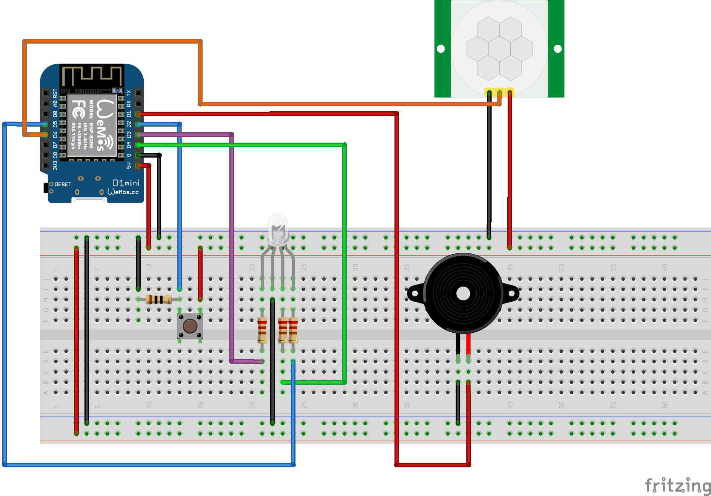
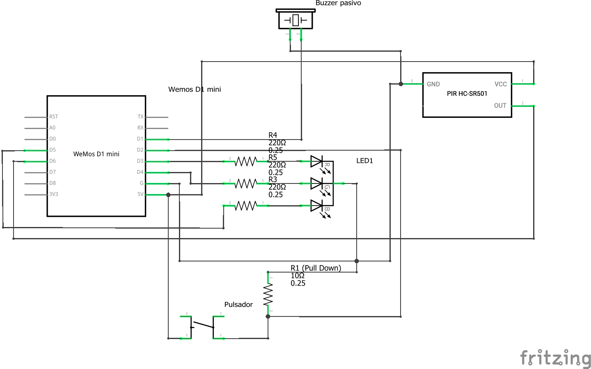

# Arduino - ALARMA CON SENSOR DE MOVIMIENTO
Alarma con sensor de movimiento y envío en tiempo de de alerta a teléfono móvil.

## Descripción
Al iniciarse el LED se activa en color MAGENTA para indicar que el sensor de movimiento se está activando correctamente. 
Cuando el sensor está preparado, el LED pasa a color AZUL para indicar que el sistema está listo para ser activado.
Para activar la alarma se presiona el pulsador y el LED pasa a color VERDE: el usuario dispone de 10 segundos para
evitar permanecer dentro de área e detección del sensor. Si el sensor detecta un movimiento enciende el LED en color ROJO,
envía un mensaje al teléfono móvil, y se activa el zumbador durante 5 segundos. Luego la alarma regresa a estado activo, lista
para detectar el siguiente movimiento.

## Componentes
- Placa Wemos D1 R2 o Wemos D1 mini
- 1 sensor PIR HC-SR501
- 1 LED RGB (cátodo común)
- 3 resistencias 220 Ohm
- 1 pulsador
- 1 resistencia 10K Ohm
- 1 zumbador pasivo
- Cablecitos de conexión
- Protoboard

## Plataformas
- Pushbullet: https://www.pushbullet.com

## Esquema de montaje en protoboard

## Esquema electrónico

